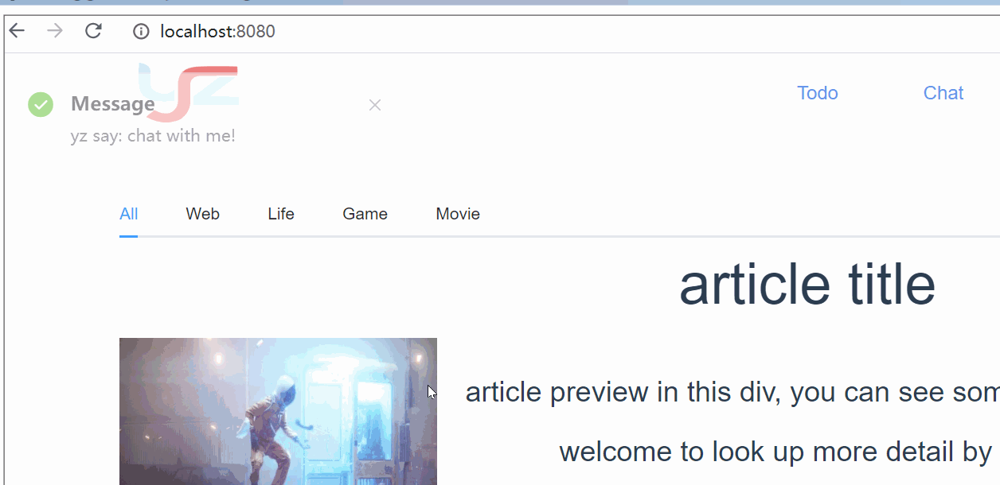
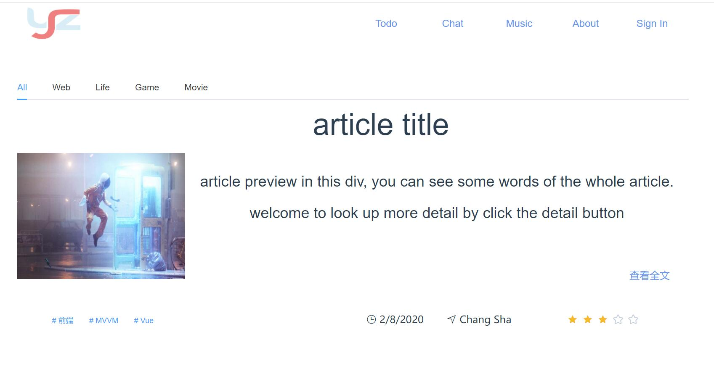
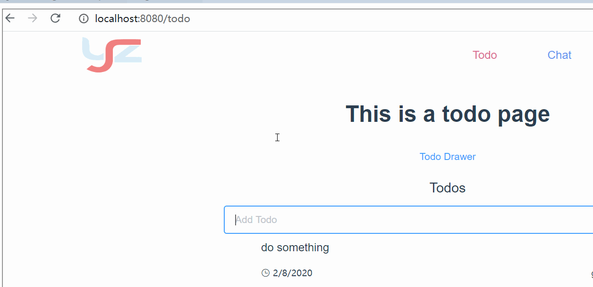
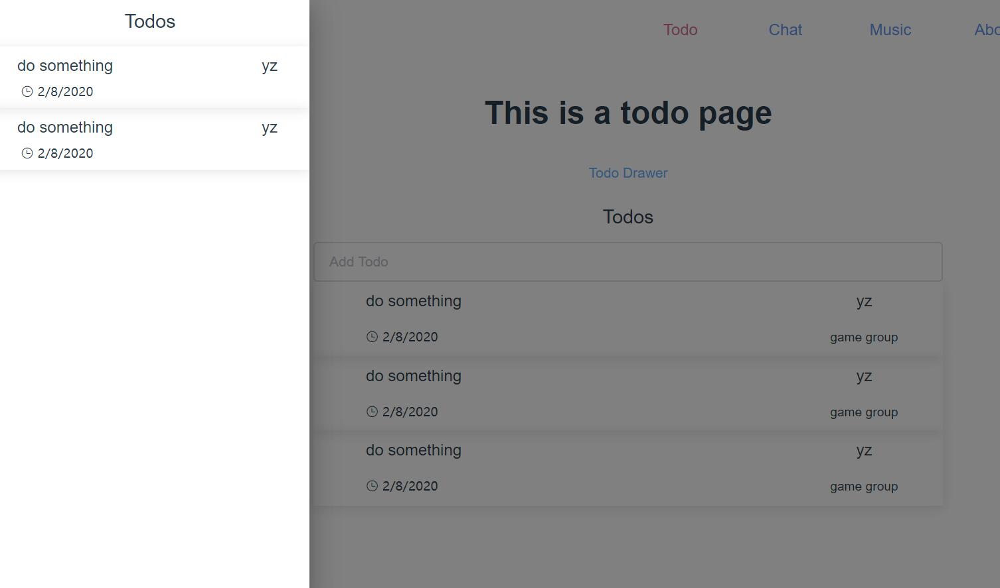
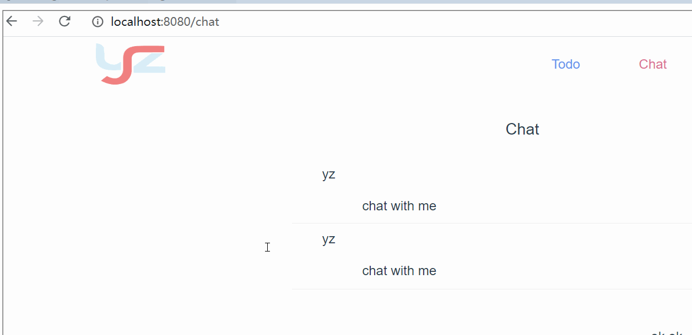
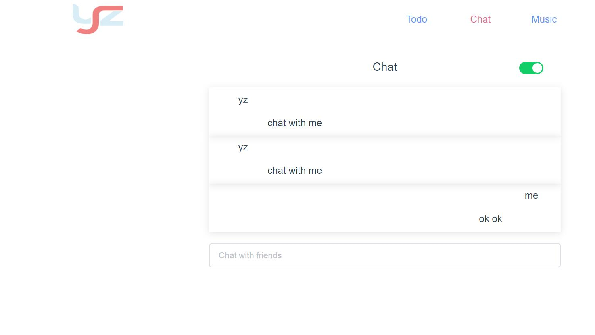
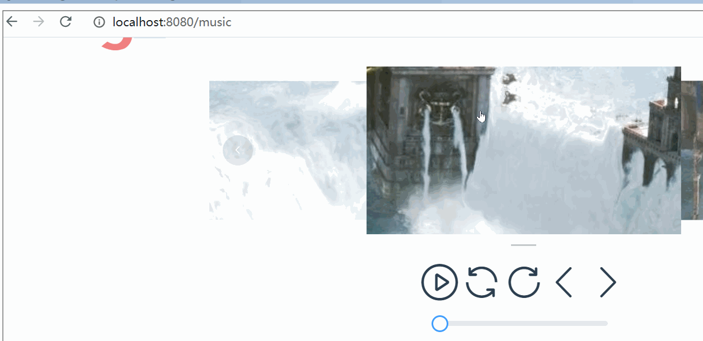
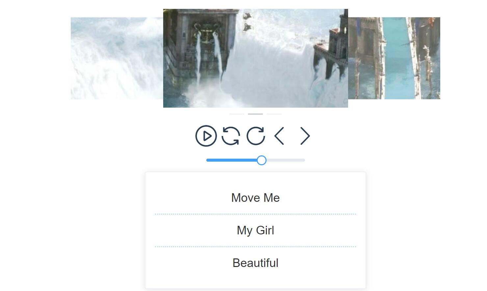

## ZZone
    - 基于 Vue + Vuex + VueRouter + Sass + Element + Axios 搭建的个人空间
    - 单页组件构建的 SPA 项目, 主 APP 入口下, 有 4 个子 App
    - 组件的分拆与层级
        - 统一的 App.Vue 入口, 设置全局的 CSS 属性
        - Views 页面注册到 VueRouter 里, 负责组装 components, 主要页面如下:
            1. Blog 页面
            2. Todo 页面
            3. Chat 页面
            4. Music 页面
        - Components 为基本的组件
            1. 全局的 Header
            2. 登陆页面的 SignIn Box
            3. Todo 页面的 Todo App 与 Todo Drawer
            4. Chat 页面的 Chat App
            5. Music 页面的 Music Player
                - Album Box 专辑系统
                - Controller 控制系统
                    - 对外暴露歌曲的暂停播放以及切歌功能
                - SongList 歌单系统

## 主要功能

### Blog
    - Blog 展示文章, Web, 前端, 后端, Game, Movie 等标签分类
    - 用户登陆后可以进行评分, 点赞, 打赏
    - 登陆后可以查看详情

### Todos
    - 小组 Todo 发布
    - 可以自由加入小组
    - 加入小组后, 可以发布自己的 Todo, 查看所有小组成员的 Todo
    - 左边能弹出 Todo Drawer 查看自己的 Todo

### Chat
    - 实时聊天室
    - 可以与小组成员实时聊天
    - 在其他页面也能接收到消息的提醒
    - 在 Chat 页面可以关闭全站的消息提醒

### Music Player
    - 暂停播放, 拖动滑条选择播放时间, 切换歌曲
    - 歌单系统, 收藏与共享
    - 专辑, 艺人, 歌词的自动轮播

